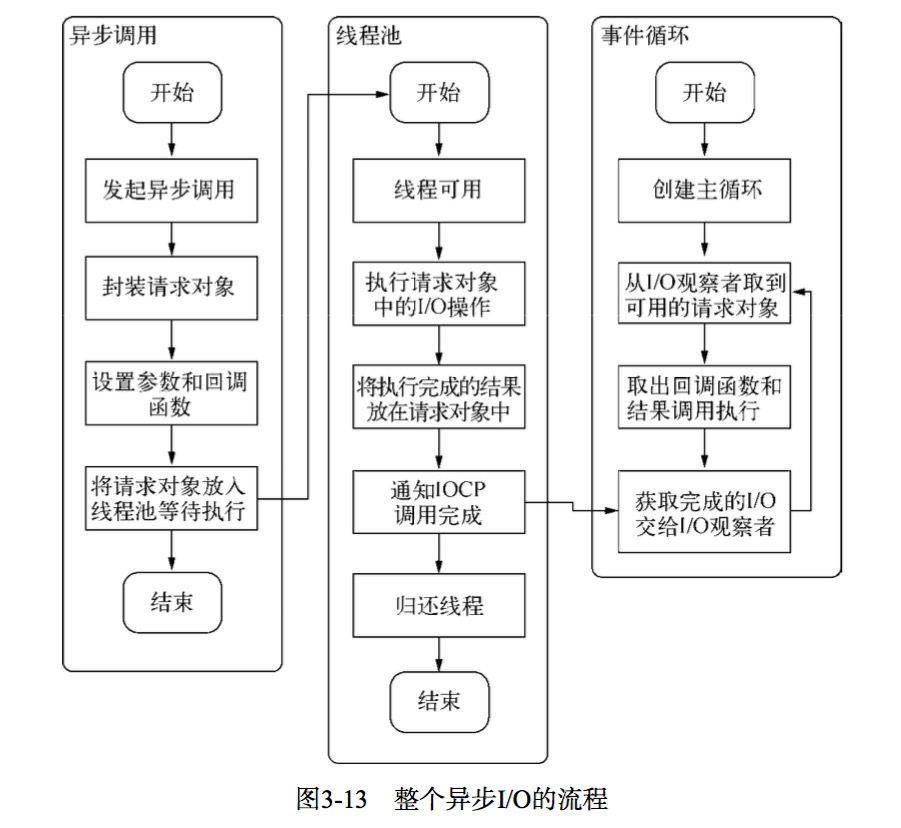
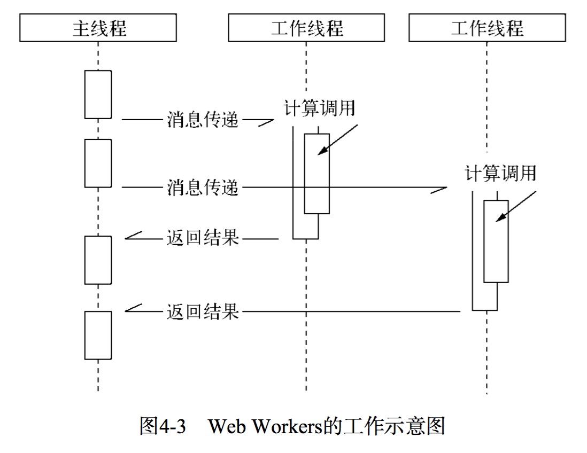

#Node(异步I/O、事件与回调函数、单线程)

[Node中文API](http://nodeapi.ucdok.com/#/api/)

##异步I/O(线程池模拟) 

事件循环 观察者 请求对象FSReqWrap 执行回调

请求对象FSReqWrap(js层传入的参数，当前方法，回调函数设置在这个对象的oncomplete_sym属性上) 

1. 部分线程进行阻塞I/O或者非阻塞I/O加轮询技术来完成数据获取
2. 让一个线程进行计算处理
3. 通过线程之间的通信将I/O得到的数据进行传递

eq:知名服务器Nginx,也摒弃了多线程的方式,采用了和Node相同的事件驱动。



##异步编程
###函数式编程

####高阶函数  ＝> 可以十分方便的进行复杂业务逻辑的解耦
除了通常意义的函数调用返回外,还形成了一种后续传递风格(Continuation Passing Style)的结果接收 方式,而非单一的返回值形式。后续传递风格的程序编写将函数的业务重点从返回值转移到了回调函数中:

```js
var points = [40, 100, 1, 5, 25, 10]; 
points.sort(function(a, b) {return a - b; });
// [ 1, 5, 10, 25, 40, 100 ]
```
Node提供的事件处理模块：事件的处理方式正是基于高阶函数的特性来完成的

```js
var emitter = new events.EventEmitter(); 
emitter.on('event_foo', function () {// TODO });
```
####偏函数(是指创建一个调用另外一个部分——参数或变量已经预置的函数——的函数的用法)
```js
_.after = function(times, func) { 
	if (times <= 0) return func(); 
	return function() {
		if (--times < 1) { return func.apply(this, arguments); } 
	};
};
```
####需解决的问题：
1.异常处理

不适用
```js
try { 
	JSON.parse(json);
} catch (e) { 
	// TODO
}
```

因为：异步I/O的实现主要包含两个阶段: 提交请求和处理结果。这两个阶段中间有事件循环的调度,两者彼此不关联。异步方法则通常在第一个阶段提交请求后立即返回,因为异常并不一定发生在这个阶段,try/catch的功效在此处 不会发挥任何作用。

调用async()方法后,callback被存放起来,直到下一个事件循环(Tick)才会取出来执行。尝试对异步方法进行try/catch操作只能捕获当次事件循环内的异常,对callback执行时抛出的异常将无能为力,示例代码如下:
```js
var async = function (callback) { 
	process.nextTick(callback);
};
```

Node在处理异常上形成了一种约定,将异常作为回调函数的第一个实参传回,如果为空值, 表明异步调用没有异常抛出:
```js
async(function (err, results) { // TODO});
```
在我们自行编写的异步方法上,也需要去遵循这样一些原则:

  **原则一:必须执行调用者传入的回调函数;**

  **原则二:正确传递回异常供调用者判断。**
```js
var async = function (callback) { 
	process.nextTick(function() {
		var results = something; 
		if (error) {
			return callback(error); 
		}
	}; 
	callback(null, results); 
});
```
	
易犯❌：对用户传递的回调函数进行异常捕获,如果回调函数有异常抛出,将会进入catch()代码块中执行,于是回调函数将会被执行两次。这显然不是预期的情况,可能导致业务混乱。
```js
try {
	req.body = JSON.parse(buf, options.reviver); 
	callback();
} catch (err){ 
	err.body = buf; 
	err.status = 400; 
	callback(err);
}
```
✅
```js
try {
	req.body = JSON.parse(buf, options.reviver);
} catch (err){ 
	err.body = buf;
	err.status = 400;
	return callback(err); 
}
callback();
```
2.函数嵌套过深
```js
fs.readFile(template_path, 'utf8', function (err, template) { 
	db.query(sql, function (err, data) {
		l10n.get(function (err, resources) { 
			// TODO
		}); 
	});
});
```
3.阻塞代码

4.多线程编程

我们在谈论JavaScript的时候,通常谈的是单一线程上执行的代码,这在浏览器中指的是JavaScript执行线程与UI渲染共用的一个线程;在Node中,只是没有UI渲染的部分,模型基本相同。对于服务器端而言,如果服务器是多核CPU,单个Node进程实质上是没有充分利用多核CPU的。

Node借鉴了webworker模式,child_process是其基础API,cluster模块是更深层次的应用。



5.异步转同步

###解决方案
####事件发布/订阅模式(**回调函数事件化**)
>事件发布/订阅模式自身并无同步和异步调用的问题,但在Node中,emit()调用多半是伴随 事件循环而异步触发的,所以我们说事件发布/订阅广泛应用于异步编程。
>事件发布/订阅模式常常用来**解耦业务逻辑**
在一些典型场景中,可以通过事件发布/订阅模式进行组件封装,将**不变的部分封装在组件内部**,将**容易变化、需自定义的部分通过事件暴露给外部处理**,这是一种典型的逻辑分离方式。
```js
// 订阅
emitter.on("event1", function (message) {
	console.log(message); 
});
// 发布
emitter.emit('event1', "I am message!");
```

事件侦听器模式也是一种钩子(hook)机制,利用钩子导出内部数据或 状态给外部的调用者。Node中的很多对象大多具有黑盒的特点,功能点较少,如果不通过事件钩 子的形式,我们就无法获取对象在运行期间的中间值或内部状态。这种通过事件钩子的方式,可 以使编程者不用关注组件是如何启动和执行的,只需关注在需要的事件点上即可。

在这段HTTP请求的代码中,程序员只需要将视线放在error、data、end这些业务事件点上 即可,至于内部的流程如何,无需过于关注。
```js
var options = {
	host: 'www.google.com', port: 80,
	path: '/upload', method: 'POST'
};
var req = http.request(options, function (res) {
	console.log('STATUS: ' + res.statusCode); 
	console.log('HEADERS: ' + JSON.stringify(res.headers)); 
	res.setEncoding('utf8');

	res.on('data', function (chunk) {
		console.log('BODY: ' + chunk); 
	});
	res.on('end', function () { 
		// TODO
	}); 
});
req.on('error', function (e) {
	console.log('problem with request: ' + e.message);
});
// write data to request body
req.write('data\n');
req.write('data\n');
req.end();
```
解决难点2:(多异步之间的协作方案，多对一)
```js
var count = 0;
var results = {};
var done = function (key, value) {
	results[key] = value; 
	count++;
	if (count === 3) {
		// 渲染页面
		render(results); 
	}
};
fs.readFile(template_path, "utf8", function (err, template) { 
	done("template", template);
});
db.query(sql, function (err, data) {
	done("data", data); 
});
l10n.get(function (err, resources) { 
	done("resources", resources);
});
```

```js
var after = function (times, callback) { 
	var count = 0, results = {};
	return function (key, value) {
		results[key] = value; count++;
		if (count === times) {
			callback(results); }
		}; 
	};
}
var done = after(times, render);

var emitter = new events.Emitter(); 
var done = after(times, render);

emitter.on("done", done); 
emitter.on("done", other);

fs.readFile(template_path, "utf8", function (err, template) { 
	emitter.emit("done", "template", template);
});
db.query(sql, function (err, data) {
	emitter.emit("done", "data", data); 
});
l10n.get(function (err, resources) { 
	emitter.emit("done", "resources", resources);
});
```
####[Promise/Defferred模式](https://github.com/alsotang/node-lessons/tree/master/lesson17)
(一种先执行异步调用,延迟传递处理的方式呢)

1.使用 promise 替代回调函数

2.promise链,提供了函数顺序执行的方法

#####Promise/A

1.Promise操作只会处在3种状态的一种:未完成态、完成态和失败态。

2.Promise的状态只会出现从未完成态向完成态或失败态转化,不能逆反。完成态和失败态
不能互相转化。

3.Promise的状态一旦转化,将不能被更改。

一个Promise对象只要具备then()方法即可。 但是对于then()方法,有以下简单的要求。
```js
then(fulfilledHandler, errorHandler, progressHandler)
```

1.接受完成态、错误态的回调方法。在操作完成或出现错误时,将会调用对应方法。

2.可选地支持progress事件回调作为第三个方法。

3.then()方法只接受function对象,其余对象将被忽略。

4.then()方法继续返回Promise对象,以实现链式调用。

	简单实现：
```js
var Promise = function () { 
	EventEmitter.call(this);
};
util.inherits(Promise, EventEmitter);
Promise.prototype.then = function (fulfilledHandler, errorHandler, progressHandler) { 
	if (typeof fulfilledHandler === 'function') {
		// 利用once()方法,保证成功回调只执行一次
		this.once('success', fulfilledHandler); 
	}
	if (typeof errorHandler === 'function') { 
		// 利用once()方法,保证异常回调只执行一次 this.once('error', errorHandler);
	}
	if (typeof progressHandler === 'function') {
		this.on('progress', progressHandler); 
	}
	return this; 
};

var Deferred = function () { 
	this.state = 'unfulfilled'; 
	this.promise = new Promise();
};
Deferred.prototype.resolve = function (obj) { 
	this.state = 'fulfilled'; 
	this.promise.emit('success', obj);
};
Deferred.prototype.reject = function (err) { 
	this.state = 'failed'; 
	this.promise.emit('error', err);
};
Deferred.prototype.progress = function (data) { 
	this.promise.emit('progress', data);
};

var promisify = function (res) { 
	var deferred = new Deferred(); 
	var result = '';
	res.on('data', function (chunk) {
		result += chunk;
		deferred.progress(chunk); 
	});
	res.on('end', function () { 
		deferred.resolve(result);
	});
	res.on('error', function (err) {
		deferred.reject(err); 
	});
	return deferred.promise; 
};

可以这样调用：
res.then(function () { 
	// Done
}, function (err) { 
	// Error
}, function (chunk) { 
	console.log('BODY: ' + chunk);
});

以前：
res.setEncoding('utf8'); 
res.on('data', function (chunk) {
	console.log('BODY: ' + chunk); 
});
res.on('end', function () { 
	// Done
});
res.on('error', function (err) {
	// Error 
});
```

这里回到Promise和Deferred的差别上。从上面的代码可以看出,Deferred主要是用于内部, 用于维护异步模型的状态;Promise则作用于外部,通过then()方法暴露给外部以添加自定义逻辑。

#####Promise中的多异步协作
```js
Deferred.prototype.all = function (promises) {
	var count = promises.length;
	var that = this;
	var results = []; 
	promises.forEach(function (promise, i) {
		promise.then(function (data) { 
			count--;
			results[i] = data; 
			if (count === 0) {
				that.resolve(results); 
			}
		}, function (err) { 
			that.reject(err);
		}); 
	});
	return this.promise; 
};

var promise1 = readFile("foo.txt", "utf-8");
var promise2 = readFile("bar.txt", "utf-8");
var deferred = new Deferred();
deferred.all([promise1, promise2]).then(function (results) {
	// TODO
}, function (err) {
	// TODO 
});
```
#####Promise模式实现同步调用(支持序列执行的Promise)
```js
调用方式：
promise()
.then(obj.api1) 
.then(obj.api2) 
.then(obj.api3) 
.then(obj.api4) 
.then(function (value4) {
	// Do something with value4 
}, function (error) {
	// Handle any error from step1 through step4 
})
.done();
```
实现：sequence.js
主要有以下两个步骤：

1.将所有的回调都存到队列中

2.Promise完成时，逐个执行回调，一旦检测到返回了新的Promise对象，停止执行，然后将当前Deferred对象的promise引用改变为新的Promise对象,并将队列中余下的回调转交给它。

####流程控制库
1.尾触发与Next(Connect中间件)
每个中间件传递请求对象、响应对象和尾触发函数,通过队列形成一个处理流
中间件机制使得在处理网络请求时,可以像面向切面编程一样进行过滤、验证、日志等功能, 而不与具体业务逻辑产生关联,以致产生耦合。
```js
	var app = connect();
	// Middleware
	app.use(connect.staticCache());
	app.use(connect.static(__dirname + '/public'));
	app.use(connect.cookieParser());
	app.use(connect.session());
	app.use(connect.query());
	app.use(connect.bodyParser());
	app.use(connect.csrf());
	app.listen(3001);
```
2.[eventproxy](https://github.com/JacksonTian/eventproxy#%E9%87%8D%E5%A4%8D%E5%BC%82%E6%AD%A5%E5%8D%8F%E4%BD%9C)

3.[async](https://github.com/caolan/async/blob/v1.5.2/README.md)

	异步的串行执行：series

	异步的并行执行：parallel

	异步调用的依赖处理： waterfall

当你需要去多个源(一般是小于 10 个)汇总数据的时候，用 eventproxy 方便；当你需要用到队列，需要控制并发数，或者你喜欢函数式编程思维时，使用 async。大部分场景是前者，所以我个人大部分时间是用 eventproxy 的。

3.step

	串行 并行 结果分组

4.wind
	
	[消除你对Wind.js的疑虑](http://cnodejs.org/topic/50103a6df767cc9a5129243b)

##玩转进程


##学习资源
[《Node.js 包教不包会》](https://github.com/alsotang/node-lessons)

##常用模块

###[eventproxy](https://github.com/JacksonTian/eventproxy#%E9%87%8D%E5%A4%8D%E5%BC%82%E6%AD%A5%E5%8D%8F%E4%BD%9C)控制并发
###[async](https://github.com/caolan/async/blob/v1.5.2/README.md)

###回调金字塔的解决办法：EventProxy、BlueBird、Async、Generator

===========================================

###[supervisor](http://www.w3cfuns.com/notes/17100/027d0b93a19cf19a0ac8c2d83500def1.html)模块，监控nodejs文件的变化并自动刷新

	安装：npm install supervisor -g
	监控文件变化：supervisor app.js

===========================================

###[benchmark](https://github.com/bestiejs/benchmark.js) 测试哪个方法更快

===========================================

###[mocha测试框架](http://mochajs.org/) [should断言库](https://github.com/tj/should.js) [istanbul测试覆盖率工具](https://github.com/gotwarlost/istanbul)

参考：[测试用例：mocha，should，istanbul](https://github.com/alsotang/node-lessons/tree/master/lesson6)
	npm i istanbul -g
	istanbul cover _mocha

===========================================

###[utility] utility.md5

	安装：npm install utility --save

===========================================

###[superagent,cheerio] 

[superagent](http://visionmedia.github.io/superagent/) http方面的库，可以发起get/post请求，用来抓取网页

[cheerio](https://github.com/cheeriojs/cheerio) Node.js 版的 jquery，用来从网页中以 css selector 取数据，使用方式跟 jquery 一样一样的。
```js
app.get('/', function (req, res, next) {
  // 用 superagent 去抓取 https://cnodejs.org/ 的内容
  superagent.get('https://cnodejs.org/')
    .end(function (err, sres) {
      // 常规的错误处理
      if (err) {
        return next(err);
      }
      // sres.text 里面存储着网页的 html 内容，将它传给 cheerio.load 之后
      // 就可以得到一个实现了 jquery 接口的变量，我们习惯性地将它命名为 `$`
      // 剩下就都是 jquery 的内容了
      var $ = cheerio.load(sres.text);
      var items = [];
      $('#topic_list .topic_title').each(function (idx, element) {
        var $element = $(element);
        items.push({
          title: $element.attr('title'),
          href: $element.attr('href')
        });
      });

      res.send(items);
    });
});

```
===========================================

###[Makefile](http://blog.csdn.net/haoel/article/details/2886)

===========================================

###浏览器端测试
mocha,[chai全栈断言库](http://chaijs.com/),[headless 浏览器 phantomjs](http://phantomjs.org/)
[phanatomjs搭建一个模拟环境，命令行的前端脚本测试环境]
	npm i -g mocha-phantomjs

===========================================

###[supertest](https://github.com/tj/supertest)

===========================================


###[nodemon](https://github.com/remy/nodemon)
自动检测node.js代码改动，然后帮你自动重启应用，在调试时完全可以用nodemon命令代替node命令

===========================================

###[测试正则表达式](http://refiddle.com/)

===========================================

###node-inspector 是一款调试工具,非常好用,基于WebKit Web Inspector

===========================================

###underscore 提供set的交、并、差、补，提供简单的模版算法，提供各种排序。

===========================================

###marked模块

===========================================

###加密模块 crypto