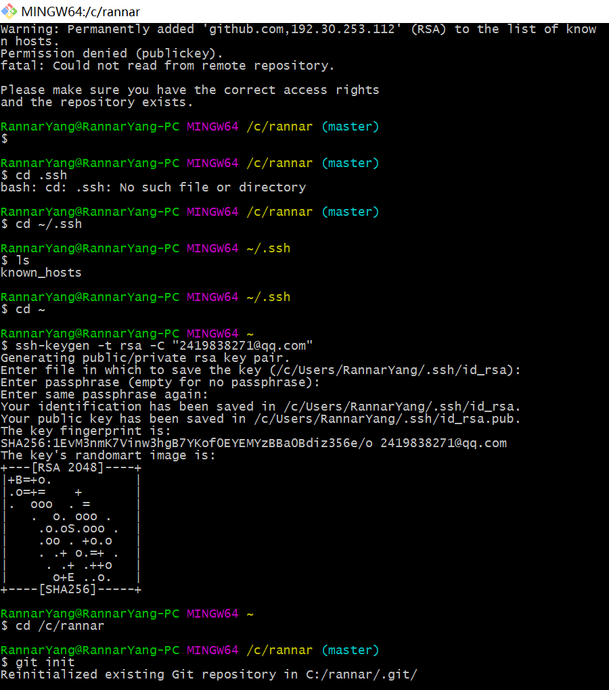

### 获取本机SSH密钥 
MAC

	cat ~/.ssh/id_rsa.pub

WINDOWS
	[参考](http://jingyan.baidu.com/article/a65957f4e91ccf24e77f9b11.html)

	cd .ssh
	cd ~/.ssh
	cd ~
	ssh-keygen -t rsa -C "2419838271@qq.com"

	进入c:/Users/xxxx_000/.ssh/目录下，打开id_rsa.pub文件，全选复制公钥内容

	
